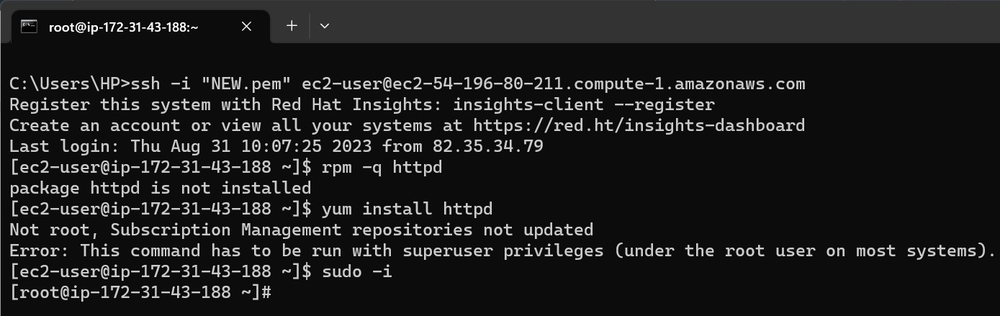
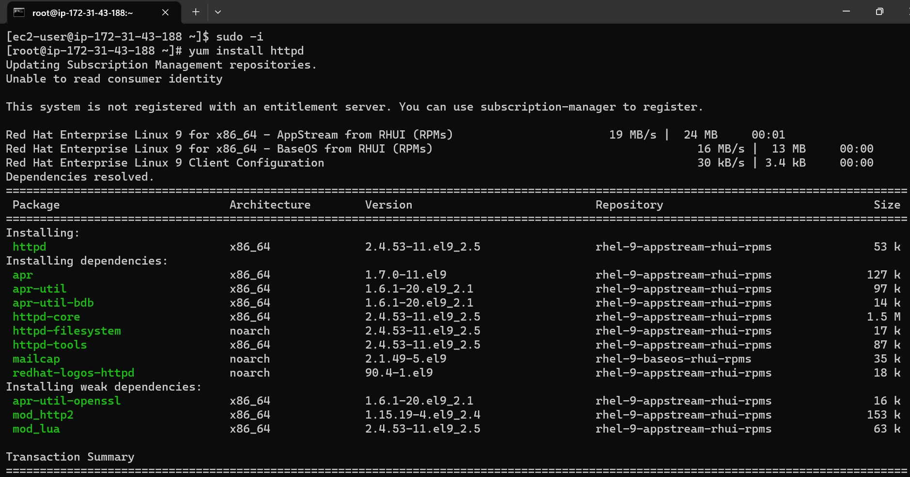
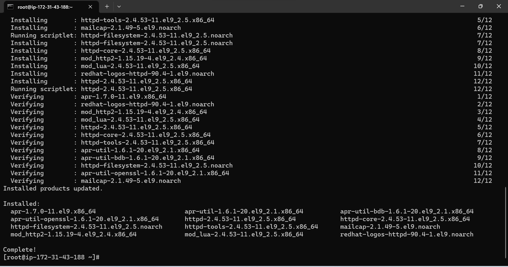
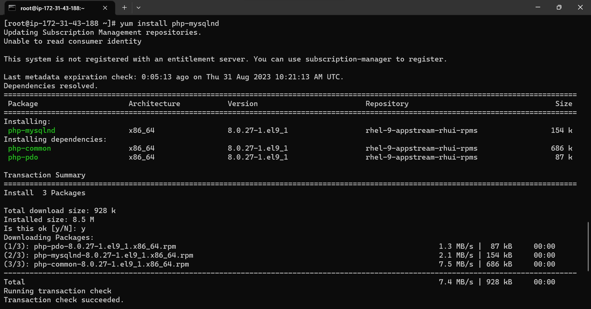
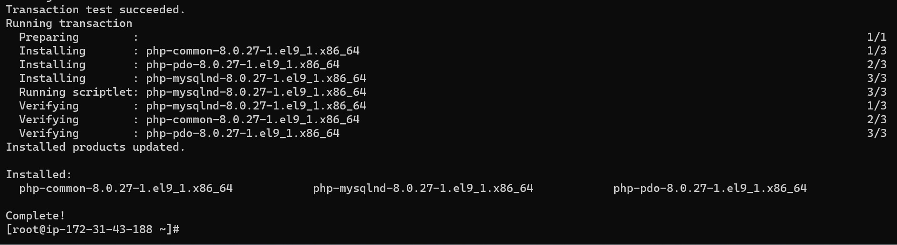
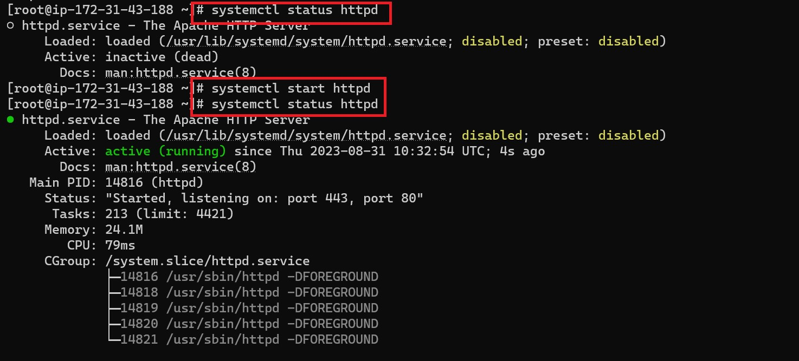
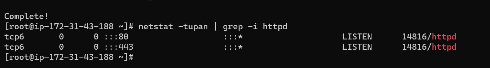

# INSTALLATION OF APACHE WEBSERVER ON RHEL/CENTOS SERVER
A web server is a Server Side software which listens and processes the client http or https requests. A Request always originates from the client machine to web server where application or other documents are hosted to be served. It can also process web applications files written in various progranning languages such as php into static html file.

Some of the accronmy used in the course of this project are:
* **rpm -** RedHat Package Manager
* **yum -** Yellowdog Updater modified

**N/B -** However we need to be aware that the RHEL/Centos use rpm and yum to execute their commands which is other than the regular sudo linux commands 

## Prerequisites:
* RHEL-9.2.0 active EC2 instance
* Windows Command prompt 
* Admin/Root privilege

**Step 1:** SSH into the EC2 terminal using the widnows cmd prompt. Changed permission to root user using the below cmd:

`root -i` 



**Step 2:** Run the below command to update the seever and install the Apache webserver as this will install the latest version of the web server.
```
yum update -y
yum install httpd -y
     or
yum install httpd
```



**Step 3:** From the above screenshot I can confirm that the installation is complete and successful, next I will install some models depending on what is required, but most importantly mysql and the openssl modesl will be installed in the course of this project but will also list other models below:
```
yum install httpd-devel
yum install httpd_perl
yum install mod_perl
yum install php-mysqlnd
```



**Step 4:** After installion of the Apache server, you confirm the status and either choose to start or enable using any the below cmds depending on what you choose to do at anytime.

I confirmed the status and it was not running then I started the server as seen in the screenshot below.
```
systemctl status httpd
systemctl start httpd
systemctl stop httpd
systemctl reload httpd
systemctl restart httpd
```


# Managing the Apache Service
By default Apache uses port 80/443 to listen, this can be confirmed using the nestat command, however before using the netstat command we need to install the net tools using the command

`yum install net-tools -y`

To confirm the port that Apache is listening run the command below.

`netstat -tupan | grep -i httpd`



Should we have any other port we want Apache to listen this can be forced using the below comman.

`netstat -tupan | grep -i '80\|443'`

To check what is running on the Apache service.

`ps aux | grep -i [h]ttp`

To check the version: `http -v`

To check if the syntax is ok, lets say some changes were made to the configuration file and we need to check if all is ok with it, run the command.

`httpd -t`


